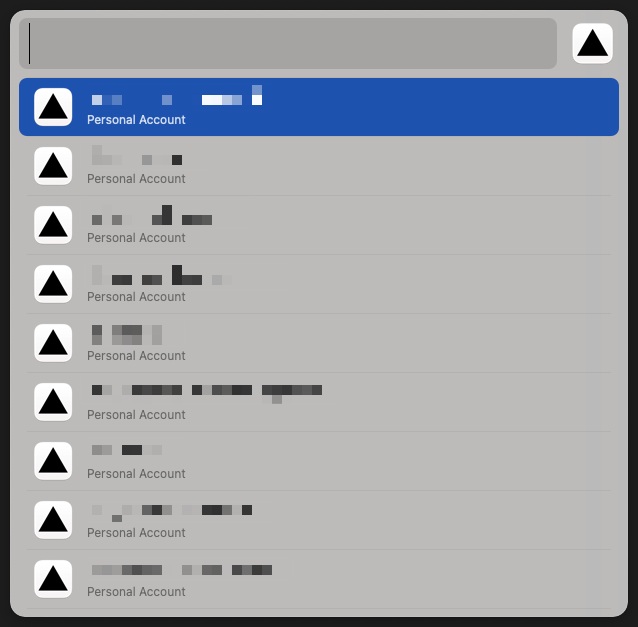
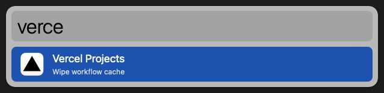

# alfred-vercel
> Quick access your Vercel projects from Alfred

## Download
1. Goto [releases](https://github.com/skydiver/alfred-vercel/releases) section
2. download .alfredworkflow file
3. open it in Alfred

## Workflow setup
1. Goto "Workflow Environment Variables"
2. Set your Vercel ACCESS_TOKEN
3. Optional: change cache timeout value (default: 1 hour)

## Usage
1. activate Alfred
2. type `vercel`
3. browse your projects

## Modifiers
* Press `command` key on a project to go directly to project deployments page
* Press `option` key on a project to go directly to project settings page

## Cache
To prevent excessive API calls, the workflow caches the results.  
By default, the cache is cleared every hour.  
You can change the cache timeout in the workflow settings.  
If you wanna clear the cache manually, press `command` key on the main "Vercel Projects" item.

## Demo

